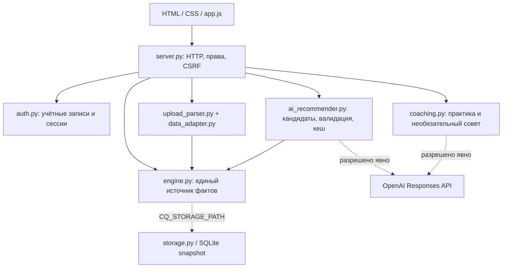

# A^2SCEND

**Персональная навигация карьерного роста.** MVP для кейса Career Quest, HackAlem AI / Halyk Bank.

Сотруднику со стажем 1–5 лет сложно выбрать полезное развитие среди разрозненных активностей. A^2SCEND связывает профиль, требования следующего грейда и каталог обучения: предлагает следующий шаг, объясняет выбор и показывает изменение покрытия требований после выполнения. HR видит разрывы компетенций и сотрудников без подходящего шага, чтобы предложить помощь. Участие добровольное; публичного рейтинга людей нет.

## Что реализовано

- Вход сотрудника и HR с проверкой прав на сервере. Сотрудник видит только свой профиль; HR читает профили, аналитику и импортирует данные, но не выполняет активности за сотрудника.
- Профиль, навыки, текущий и целевой грейд, разрывы, история и 1–3 рекомендации.
- Детерминированный рейтинг по четырём факторам: соответствие грейду, влияние на траекторию, история, выполнимость. Разбор факторов доступен в «Почему этот шаг».
- Необязательный Hybrid AI: LLM выбирает порядок локально допустимых кандидатов; схема и бизнес-ограничения проверяются отдельно. При ошибке остаётся алгоритмический подбор.
- Единый бюджет времени для рекомендаций и планировщика. What-if последовательно применяет до трёх шагов к копии профиля без изменения навыков, истории и XP.
- Выполнение активности, пересчёт навыков и покрытия требований; повторное выполнение не даёт дополнительный эффект. XP, уровни, достижения и недельная цель остаются необязательными. Добровольная пауза сохраняет прогресс.
- HR: суммарные разрывы уровней, участие по активностям, причины отсутствия следующего шага, отсутствие требований, паузы и приватный список для предложения помощи.
- Пакетный импорт JSON/CSV с серверным предпросмотром, ошибками и предупреждениями; явное дополнение или замена набора.
- Необязательное транзакционное сохранение согласованного состояния в SQLite. По умолчанию — memory-режим.
- Чёрно-лаймовый интерфейс, системные шрифты, мобильная компоновка, управление диалогами с клавиатуры, reduced motion. Для интерфейса не нужен интернет.
- Из `fuse/` адаптированы строгий парсер загрузки, журнал доступа HR, изоляция закрытых диалогов и синхронизация состояния входа между вкладками. [Подробный отчёт интеграции](docs/integration-report.md).

## Как работает решение

1. Сессия определяет роль и разрешённый профиль. Backend сопоставляет уровни навыков с требованиями следующего грейда.
2. Движок исключает завершённые, неподходящие по роли и не закрывающие разрыв активности. При заданном бюджете исключает слишком долгие шаги.
3. Для каждого кандидата рассчитываются четыре фактора, score и ожидаемый прирост покрытия требований. Первичный экран отображается без ожидания AI.
4. Если внешний AI разрешён, LLM сравнивает до шести кандидатов и возвращает 1–3 ID с порядком и ссылками на факторы. Локальная проверка повторно проверяет доступность и ограничения. Самостоятельно создавать активности или менять факты модель не может.
5. Сотрудник изучает объяснение, моделирует результат и по собственному выбору отмечает активность выполненной. Только локальный движок меняет навыки, историю и XP.
6. HR использует агрегаты и причины отсутствия шага для поддержки и дополнения каталога.

Покрытие требований (`readiness`) = среднее `min(текущий / требуемый уровень, 1) × 100%`. При отсутствии требований расчёт недоступен, а не равен 100%. Это модельный показатель по каталогу, не подтверждение компетенции и не обещание повышения. Изменение 70,8% → 77,1% — **+6,3 процентного пункта**.

Score = `46% grade relevance + 26% trajectory impact + 18% history fit + 10% feasibility`. Это ручная многофакторная формула, а не вероятность повышения или уверенность AI. Gains и max_level берутся из каталога. XP рассчитывается отдельно: 100 за уникальную завершённую активность, уровень каждые 300 XP.

## Технологии и архитектура

Python 3.10+, стандартная библиотека (`http.server`, `sqlite3`, `urllib`, `unittest`, threading); HTML/CSS/vanilla JavaScript, Fetch API. Обязательных pip/npm-зависимостей, Docker, внешней БД и CDN нет. Необязательный сервис — OpenAI Responses API; модель задаётся явно через `OPENAI_MODEL`, модели по умолчанию нет.



`fuse/` не запускается и не импортируется основным приложением. В нём сохранён исходный дополнительный проект. Его `security.py` также был скопирован в основную папку до этой интеграции; рабочая авторизация использует **auth.py**, а не второй набор пользователей из security.py.

## Установка и запуск

Нужен установленный Python 3.10+ и браузер. Из корня репозитория:

```bash
cd career-quest
python server.py
```

На Unix допустимо `python3 server.py`. Откройте [локальное приложение](http://127.0.0.1:8000). Данные входа для `employee` и `hr` выводятся в терминале сервера; без конфигурации пароли случайные при каждом запуске. Для остановки — Ctrl+C. При занятом порте остановите прежний процесс или используйте `python server.py --port 8001`.

Чтобы сохранить пароли между запусками, задайте их в своей оболочке. Значения ниже — заполнители, не рабочие секреты.

PowerShell:

```powershell
$env:CQ_EMPLOYEE_PASSWORD = "<свой-пароль-сотрудника>"
$env:CQ_HR_PASSWORD = "<свой-пароль-HR>"
python server.py
```

Unix:

```bash
export CQ_EMPLOYEE_PASSWORD='<свой-пароль-сотрудника>'
export CQ_HR_PASSWORD='<свой-пароль-HR>'
python3 server.py
```

Сотрудник привязан к E0028; `CQ_EMPLOYEE_ID` позволяет задать другой существующий ID. `.env` автоматически не загружается: [.env.example](career-quest/.env.example) — только справочник переменных. По умолчанию сервер слушает 127.0.0.1. Для внешнего развёртывания нужны управляемая инфраструктура, HTTPS и секреты; это локальный MVP.

В проверенной Windows-среде команда `python` оказалась недоступным Store-псевдонимом. Проверки выполнены Python 3.13.14 из установленного pgAdmin с добавлением папки приложения в `sys.path`. Это особенность среды проверки, не зависимость приложения от pgAdmin. На обычной установке Python достаточно команды выше.

## Offline, Hybrid AI и live smoke

Без конфигурации сети нет: доступен алгоритмический рейтинг и локальные планы практики. Внешний AI требует одновременно ключ, модель и разрешение. PowerShell:

```powershell
$env:OPENAI_API_KEY = "<ключ-в-секретном-хранилище>"
$env:OPENAI_MODEL = "<доступная-модель-с-Structured-Outputs>"
$env:CQ_ALLOW_EXTERNAL_AI = "1"
python server.py
```

Unix:

```bash
export OPENAI_API_KEY='<ключ-в-секретном-хранилище>'
export OPENAI_MODEL='<доступная-модель-с-Structured-Outputs>'
export CQ_ALLOW_EXTERNAL_AI=1
python3 server.py
```

Формат `text.format` сверён с [официальной документацией Structured Outputs](https://developers.openai.com/api/docs/guides/structured-outputs). Совместимость конкретной модели зависит от выбранного API-доступа.

Рекомендатель передаёт роль, грейды, разрывы, агрегаты истории, факторы, длительность и прогноз. Перед отправкой все произвольные названия и ID заменяются локальными псевдонимами; известные роли/грейды сохраняются. Нет имени, employee_id, контактов или сырых записей истории. Обратное соответствие ID остаётся локально. Это минимизация, **не доказательство анонимности** сочетания признаков. Коучинг также не отправляет импортированные свободные строки.

LLM не меняет gain, max_level, требования, длительность, фактический прогресс, XP и историю. JSON-схема не доказывает истинность свободного объяснения: в интерфейсе рекомендации отображаются локальные факторы и числовое сравнение с выбранной альтернативой. Свободный текст reranker не показывается как установленный факт. Отдельный совет коучинга — предложение практики, не оценка сотрудника.

Reranking ограничен общим ожиданием 8 секунд и четырьмя daemon-workers; глобальная блокировка движка во время сети не удерживается. Кеш до 128 записей: контекст, ревизия, бюджет, модель и отпечаток ключа; TTL успешного результата 300 с, fallback 15 с. Поздние ответы проверяются по состоянию и поколению запроса интерфейса. HR-агрегаты не вызывают LLM по каждому сотруднику.

```bash
python ai_smoke_test.py --live
```

Этот тест использует тот же клиент, контекст, парсер и валидаторы, отдельный синтетический движок и новый пустой кеш. Один запрос без повторов; одинаковый порядок допустим. Без любого из четырёх условий — `SKIPPED`, без сети. При fallback/ошибке live-тест завершается ненулевым кодом. Обычный unittest не делает live-вызовов.

**Текущая live-проверка: SKIPPED. Реальная AI-интеграция не проверена.**

## Данные и импорт

Встроенные данные синтетические: 200 сотрудников, четыре роли, 12 навыков и 12 активностей; генерация воспроизводима. `sample_upload/` — синтетические проверочные профили и история. Официального starter kit с подтверждённым происхождением в рабочем дереве не найдено; совместимость именно с ним **не подтверждена**. Прямых интеграций с Halyk, HRIS, LMS или SSO нет.

HR → «Загрузить датасет»: выберите один или несколько JSON/CSV. Предпросмотр покажет сущности, количества, предупреждения и ошибки до применения. При изменении состояния между просмотром и применением нужно повторить проверку.

- **Дополнить / обновить**: профили и каталоги объединяются по ID; история добавляется без точных повторов и не удаляет старые записи. Если исходный набор демо, интерфейс явно сообщает о смешении.
- **Заменить весь набор**: нужны все четыре раздела (`employees`, `skills`, `events`, `history`), включая явно пустую историю; старый набор заменяется целиком.
- Старые прямые API-запросы без `mode` сохраняют legacy-семантику частичного импорта с предупреждением о замене истории переданных сотрудников. Новый UI всегда передаёт явный режим.

Поддерживаются списки и словари по ID; один профиль можно передать объектом. `profiles` — псевдоним employees, `activity_history` — history. UTF-8 с BOM поддерживается. CSV: обязательны employee_id,event_id,status; дополнительные on_time,date; разделитель запятая или точка с запятой. Статусы completed/skipped/declined, missed нормализуется в skipped. JSON с повторными ключами, NaN/Infinity и слишком глубокой структурой отклоняется.

Схемы нормализуются перед проверкой ссылок и чисел. Навыки 0–5; требования 1–5; gain 0–5; max_level 1–5; длительность 0–10000 ч. Bool не принимается за число. Неизвестные поля профиля, например зарплата или auth_role, не сохраняются. Лимит загрузки: 1–8 файлов, до 4 МБ каждый, 6 МБ содержимого суммарно, до 8 МБ HTTP-body. После проверки строится временное состояние, выполняется preflight и только затем commit.

HR-метрики различаются: распределение статусов и общая завершаемость считаются по **записям истории**; таблица активностей — по **уникальным сотрудникам** для каждой активности. Завершение имеет приоритет, иначе последняя запись по дате и порядку. Завершённость = завершили / участники. «Подходит по роли» относится к текущему составу, исторические участники могут отличаться. Разрывы на графике — сумма недостающих уровней, не число людей. Среднее покрытие исключает профили без требований.

## Сохранение и безопасность

Memory-режим не сохраняет изменения после остановки. Для SQLite перед запуском:

```powershell
$env:CQ_STORAGE_PATH = "./progress.sqlite"
python server.py
```

```bash
CQ_STORAGE_PATH=./progress.sqlite python3 server.py
```

Хранятся профили, требования/каталог, история, паузы и ревизия. XP восстанавливается из истории; gains повторно не применяются. Complete, участие, reset и import транзакционны; ошибка записи откатывает состояние в памяти. Повреждённое сохранение останавливает запуск, не заменяется демо. Остановите приложение, сохраните копию повреждённого файла и восстановите проверенную резервную копию; для явного нового старта используйте другой путь. Сессии и API-ключи в БД не сохраняются. Локальная БД не зашифрована: доступ к файлу ограничивает администратор ОС. Поддерживается один процесс приложения на файл.

Сессии живут 8 часов; новый вход отзывает предыдущую сессию аккаунта. Пароли PBKDF2-HMAC-SHA256, 200000 итераций. HttpOnly/SameSite cookie, CSRF, проверка Origin, ограничение входа по адресу клиента, CSP и allowlist публичных файлов. `CQ_SECURE_COOKIE=1` — только для HTTPS. Журнал HR ограничен текущим процессом; не является промышленным неизменяемым аудитом. [Точная модель безопасности](career-quest/SECURITY.md).

## Проверка жюри

Из `career-quest/`:

```bash
python -m unittest discover -s tests -v
python evaluation.py
python benchmark.py
python ai_smoke_test.py --live
```

[Демо-сценарий](docs/demo-script.md) повторяет путь E0028 от выбора шага до импорта. [Отчёт интеграции и измерений](docs/integration-report.md) фиксирует baseline и фактические результаты. Evaluation проверяет бизнес-инварианты, а не экспертное качество LLM или эффект внедрения.

Необязательная браузерная проверка установленным Chromium, без pip:

```powershell
python browser_smoke.py --browser "C:/Program Files/Google/Chrome/Application/chrome.exe"
```

Она поднимает отдельный локальный сервер с синтетическими данными и отключённым AI. Скриншоты и отчёт — в игнорируемой папке `browser-artifacts/`.

## Ограничения и развёртывание

- Нет подтверждённой deployed-версии. Проверена локальная работа.
- Нет промышленного SSO, подтверждения компетенций через assessment/LMS, уведомлений или интеграций с кадровыми системами.
- Нет доказанного роста вовлечённости или качества AI-ранжирования. Веса и пороги — гипотеза MVP; нужен добровольный пилот и экспертная оценка.
- Модельный прирост отражает правила каталога; факт прохождения отмечает сам сотрудник.
- HTTP-сервер и локальные аккаунты предназначены для демонстрации. SQLite не обеспечивает синхронизацию нескольких процессов.
- Внешний коучинг сохраняет socket timeout 8 с; общий wall-clock deadline реализован у reranker. При зависшем системном вызове его worker может остаться живым, но ответ reranking возвращается по дедлайну.
- Внешний AI требует согласованного разрешения и подходящей модели; live-вызов в этой среде не выполнен.
